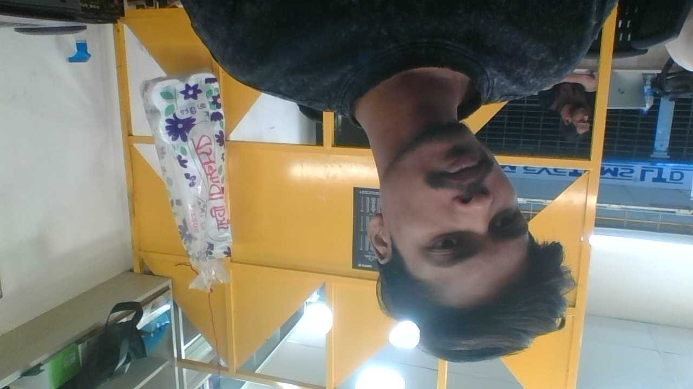

#  Personal Portfolio

A clean, responsive **personal portfolio website** built with **Bootstrap 5**. Showcases my skills, services, and projects in a modern layout.



## 

| Page | Description |
|------|-------------|
| **Home** | Hero section with key services overview |
| **Portfolio** | Project cards with modal detail views |
| **About** | Tech stack progress bars (HTML, CSS, JS, Git) |
| **Services** | Full list of offered services |
| **Contact** | Contact form + Google Maps embed |

##  Built With

- **HTML5** — Semantic structure
- **CSS3** — Poppins font, smooth transitions, card hover effects
- **Bootstrap 5** — Navbar, cards, modals, grid layout, progress bars
- **JavaScript** — Live clock display
- **Font Awesome / Emoji** — Service icons

##  Features

- ✅ Fully responsive layout (mobile-first)
- ✅ Sticky dark navbar with active page tracking
- ✅ Animated card hover effects
- ✅ Modal popups for project details
- ✅ Live server time (auto-updating)
- ✅ Google Maps embed on contact page
- ✅ Smooth scrolling

##  Live Demo

[View Live](https://junierrafsan10-del.github.io/portfolio/)

##  Getting Started

```bash
# Clone the repo
git clone https://github.com/junierrafsan10-del/portfolio.git

# Open index.html in your browser
open index.html
```

## 

[](https://github.com/junierrafsan10-del)

---

<p align="center"><i>Built with ❤️ by Rafsan Jany</i></p>
